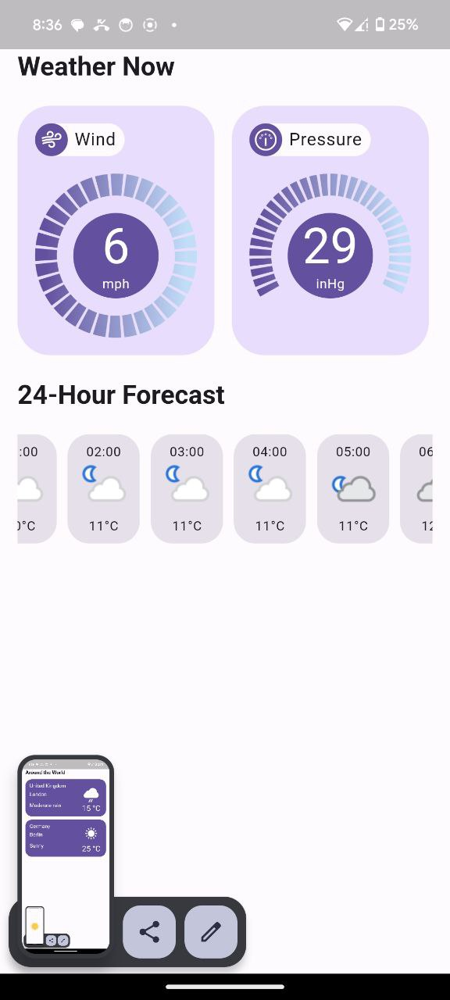

# Simple Weather App




## Getting Started
1. Get your API key by creating an account at [WeatherAPI](https://www.weatherapi.com).
2. Clone the repository

   ```sh
   git clone https://github.com/vovaklh/Simple-Weather-App
   ```
3. Install fvm to our local machine
   ```sh
   dart pub global activate fvm
   ```
4. Run the fvm command in project root
   ```sh
   fvm use
   ```
5. Run the App
   ```dart
   fvm flutter run --dart-define=WEATHER_API_KEY={your_api_key}
   ```
---
